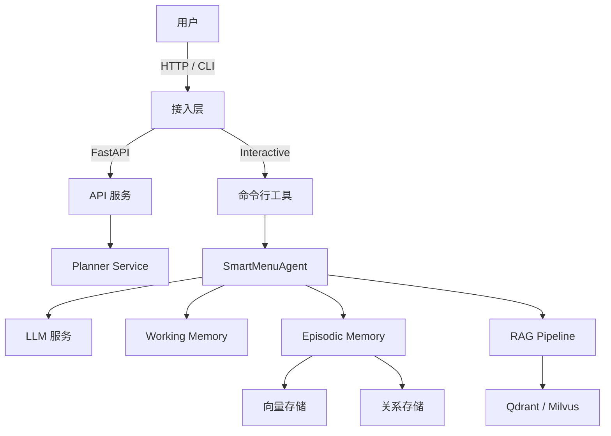

# FoodPlanGPT 技术架构文档

**项目名称**: FoodPlanGPT (属于韩晗的一周食谱)  
**当前版本**: 0.1.0  
**最后更新**: 2026-01-09

---

## 1. 项目概述

**FoodPlanGPT** 是一个智能食谱推荐系统，旨在根据一周的天气情况、当季蔬菜价格以及用户的历史偏好，为用户生成个性化的一周三餐食谱。系统采用 **FastAPI** 作为后端框架，集成了基于 **LLM (大语言模型)** 的 Agent 智能体，并配备了先进的 **Memory (记忆系统)** 模块，支持情景记忆 (Episodic Memory) 和工作记忆 (Working Memory)，以实现长期个性化交互。

### 核心功能
*   **智能菜谱生成**: 结合环境数据（天气、菜价）与用户对话生成菜谱。
*   **多模态记忆系统**:
    *   **工作记忆 (Working Memory)**: 处理当前会话的上下文，支持意图识别和短期交互。
    *   **情景记忆 (Episodic Memory)**: 使用向量数据库存储历史交互事件，支持模式识别。
*   **高级 RAG 管道**: 基于 Qdrant 和 MarkItDown 的检索增强生成，支持多格式文档入库与语义检索。
*   **Agent 交互**: 基于 ReAct 模式的智能体，支持多步推理和工具调用。

---

## 2. 系统架构

系统整体架构分为三层：**接口层 (API/CLI)**、**核心逻辑层 (Agent & Services)** 和 **基础服务层 (Memory & Storage)**。

### 架构图示 (概念)


---

## 3. 目录与模块结构

项目采用典型的 Python 模块化结构：

```text
app/
├── main.py                 # FastAPI 应用入口
├── agent/                  # 智能体核心逻辑
│   ├── agent.py            # Agent 抽象接口
│   ├── baseAgent.py        # Agent 基类实现
│   └── smart_menu_agent.py # 核心菜谱智能体 (ReAct模式)
├── memory/                 # 记忆系统 (核心亮点)
│   ├── baseMemory.py       # 记忆基类与配置
│   ├── WorkingMemory.py    # 短期工作记忆实现
│   ├── EpisodicMemory.py   # 长期情景记忆实现
│   ├── Semantic.py         # 语义记忆 (图谱)
│   └── storage/            # 存储后端 (Neo4j, PostgreSQL)
├── api/                    # API 路由
│   ├── chat.py             # 对话接口 (核心)
│   └── meal.py             # 食谱生成接口
├── tools/                  # MCP 工具系统
│   ├── base.py             # 工具基类与注册器
│   ├── weather_tool.py     # 天气预报工具
│   └── ingredient_price_tool.py  # 食材价格工具
├── scripts/                # 脚本工具
│   └── ingest_documents.py # 知识库入库脚本
├── services/               # 业务服务
│   ├── rag_pipeline.py     # RAG 管道实现 (核心功能)
│   └── planner.py          # 静态食谱数据
├── llm/                    # LLM 集成
│   └── select_llm.py       # LLM 调用封装
├── schemas/                # 数据模型 (Pydantic)
├── prompt/                 # 提示词模板
│   └── default_prompt.py   # ReAct 模板 (含 MCP 上下文)
└── utils/                  # 工具函数
    ├── milvus_store.py     # Milvus 连接管理
    └── text_process.py     # 文本处理与分词
```


---

## 4. 核心模块详解

### 4.1 智能体 (Agent)
位于 `app/agent/smart_menu_agent.py`。
*   **类**: `SmartMenuAgent(BaseAgent)`
*   **模式**: ReAct (Reasoning and Acting)。
*   **核心能力**:
    *   **RAG 增强**: 自动检索知识库获取营养学/菜谱信息
    *   **MCP 工具**: 调用天气预报、食材价格工具获取实时数据
    *   **语义记忆**: 查询 Neo4j 图谱获取用户偏好和知识关系
    *   **自主学习**: 从对话中提取实体/关系，自动更新知识图谱
*   **工作流**:
    1.  **Input**: 接收用户自然语言输入
    2.  **Context Enrichment**: 获取天气、菜价、知识库、图谱上下文
    3.  **Prompt Construction**: 组装完整 Prompt
    4.  **LLM Invoke**: 调用 LLM 推理
    5.  **Parse & Execute**: 解析 JSON 响应，执行动作
    6.  **Learn**: 从对话中提取新知识存入图谱
*   **交互**: 提供 `cli()` 方法用于命令行测试，或通过 API 调用

### 4.2 API 层 (`app/api/`)

系统提供 RESTful API 供前端调用，基于 FastAPI 实现。

#### A. 启动服务
```bash
cd app
python main.py
# 或
uvicorn app.main:app --reload --port 8000
```

访问 `http://localhost:8000/docs` 查看 Swagger 文档。

#### B. 核心端点

| 端点 | 方法 | 说明 |
|:---|:---:|:---|
| `/api/chat` | POST | **对话接口** - 与 Agent 进行多轮对话 |
| `/api/chat/sessions` | GET | 列出所有活跃会话 |
| `/api/chat/context` | GET | 获取环境上下文 (天气+菜价) |
| `/api/meal/weekly-meal` | GET | 获取静态示例食谱 |
| `/api/meal/generate` | POST | **动态生成食谱** - 调用 Agent |
| `/api/meal/ingredients` | GET | 获取当季食材价格 |
| `/api/meal/weather` | GET | 获取天气预报 |

#### C. 对话接口示例

**请求**:
```json
POST /api/chat
{
  "message": "我想减肥，帮我规划一周低卡食谱",
  "city": "上海"
}
```

**响应**:
```json
{
  "session_id": "abc123...",
  "message": "根据上海未来一周天气和当季食材...(详细食谱)",
  "action_type": "final",
  "timestamp": "2026-01-14T17:00:00",
  "context": {
    "weather_city": "上海",
    "season": "冬季"
  }
}
```

#### D. 动态生成接口示例

**请求**:
```json
POST /api/meal/generate
{
  "preferences": "清淡,低油",
  "allergies": ["海鲜"],
  "health_goal": "减脂",
  "city": "北京",
  "budget": "medium"
}
```

**响应**:
```json
{
  "weekly_plan": "一周食谱方案...",
  "weather_summary": "北京: 晴, 2~10°C",
  "ingredient_tips": "冬季推荐温补食物...",
  "generated_at": "2026-01-14T17:00:00"
}
```


### 4.3 记忆系统 (Memory System)
位于 `app/memory/`，是系统的核心亮点。


#### A. 基础架构 (`baseMemory.py`)
*   定义了 `MemoryItem` 数据结构：包含 `content` (内容), `keyword` (关键词), `importance` (重要性), `timestamp` (时间戳) 等。
*   定义了 `MemoryConfig`：管理存储路径、容量限制、衰减因子 (`decay_factor`) 等。
*   实现了重要性计算算法：基于 Jaccard 相似度计算当前记忆与历史记忆的关联度。

#### B. 情景记忆 (`EpisodicMemory.py`)
*   **用途**: 存储具体的交互事件 (Episode)，用于长期的个性化回忆。
*   **存储机制**: 双层存储。
    *   **PostgreSQL**: (通过 `PostgreSQLDocumentStore`) 作为权威文档存储，保存完整的事件细节。
    *   **Milvus**: 向量数据库，存储 Embedding 后的向量，用于语义搜索 (Semantic Search)。
*   **功能**:
    *   `add`: 添加新事件，同时更新向量库和关系库。
    *   `retrieve`: 基于语义相似度检索相关历史事件。
    *   `patterns`: 具备模式识别缓存 (`patterns_cache`)，用于未来分析用户习惯。

#### C. 工作记忆 (`WorkingMemory.py`)
*   **用途**: 维护当前会话的上下文，类似于计算机的 RAM。
*   **特性**:
    *   纯内存存储，速度快。
    *   当容量不足时，根据重要性和时间（TTL）进行遗忘或归档。
    *   用于 Agent 构建每一轮对话的 Prompt Context。

#### D. 记忆分类与存入决策机制 (Memory Routing)
系统通过多层记忆架构实现信息的精细化管理和长期演化，决定哪些信息存入情景记忆，哪些存入语义记忆。

##### 1. 情景记忆 (Episodic Memory) - “交互事件流”
*   **分类标准**: 侧重于记录**具体的时间、地点、人物和对话原文**。它像是一本“日志”，记录了系统与用户的每一次完整接触。
*   **存入机制**: 
    *   **即时记录**: 在每一轮对话（User -> Assistant）结束时，系统将原始文本、元数据（session_id, user_id）及时间戳打包存入其双层存储（PG + Milvus）。
    *   **关键函数**: `SmartMenuAgent.cli` 或 API 处理流程中显式调用 `self.episodic_memory.add()`。
*   **价值**: 提供长期的“相关性回忆”，当用户问及“上次那个...”时，通过向量检索快速回溯相似片段。

##### 2. 语义记忆 (Semantic Memory) - “稳固知识与偏好”
*   **分类标准**: 侧重于从对话中剥离出的**纯粹知识事实**。例如：实体、属性以及实体间的逻辑关系（如：用户-不喜欢-胡萝卜）。
*   **存入机制**: 采用即时提取与延迟总结的双重策略。
    *   **即时提取 (Direct Learning)**:
        *   每轮对话后，利用 `MEMORY_EXTRACTION_PROMPT` 驱动 LLM 识别对话中的实体和关系。
        *   **决策逻辑**: 若 LLM 识别出新的口味、过敏原或目标，立即调用 `self.semantic_memory.add_entity/relation` 写入 Neo4j。
    *   **延迟反思 (Self-Reflection)**:
        *   **触发频率**: 每隔 N 轮交互（默认为3轮）或任务完成时触发。
        *   **决策逻辑**: 检索最近 10 条情景记忆，利用 `REFLECTION_PROMPT` 让 LLM 分析并提炼其中**稳定、重复出现**的用户特质。
        *   **目的**: 过滤掉临时的、偶然的情绪或请求，仅将经过验证的长效偏好固化到语义图谱中。

##### 3. 决策路由总结表

| 维度 | 工作记忆 (WM) | 情景记忆 (EM) | 语义记忆 (SM) |
| :--- | :--- | :--- | :--- |
| **存储内容** | 当前任务意图、临时约束 | 完整的对话历史片段 | 实体、属性、关系图谱 |
| **生命周期** | 会话级 (Session-level) | 永久 (Permanent) | 永久 (Permanent) |
| **决定权** | 意图识别器 (TextProcess) | 架构硬编码 (每步执行) | LLM 推理判定 (事后反思) |
| **存储介质** | RAM (Dict) | PG + Milvus | Neo4j |
| **主要用途** | 维持连贯对话 | 场景回溯、模式识别 | 用户画像、深度偏好匹配 |


### 4.4 RAG 管道 (`rag_pipeline.py`)

`app/services/rag_pipeline.py` 实现了基于 **Milvus** 和 **Neo4j** 的 Advanced GraphRAG 管道。该模块整合了向量检索的灵活性与图谱的结构化能力。


#### A. 核心组件
*   **多格式支持**: 集成 `MarkItDown`，支持 PDF, Office 文档, 图像, 音频, 纯文本等多种格式的读取，并统一转换为 Markdown 格式。
*   **智能分块**:
    *   **Markdown 感知**: 使用 `_split_paragraphs_with_headings` 识别 Markdown 标题层级，保留文档结构语义。
    *   **动态合并**: 提供 `chunk_size` (默认 800 tokens) 和 `overlap` (100 tokens) 控制，自动合并短段落并处理重叠。
    *   **元数据丰富**: 自动提取 `heading_path` (标题路径), `content_hash` (去重), `source_path` 等元数据。
*   **双重存储 (Dual Storage)**:
    *   **Vector Store (Milvus)**: 存储文本 Embeddings，用于核心的语义检索（Top-K）。
    *   **Graph Store (Neo4j)**: 自动构建 `Document -> HAS_CHUNK -> Memory` 图谱。任何入库的文档都会被溯源，为未来的逻辑推理和上下文扩展提供图谱支持。
*   **嵌入与重排序**:
    *   **Unified Embedder**: 统一调用嵌入模型，具备自动批处理和错误重试机制。
    *   **Markdown 预处理**: 在 Embedding 前清洗 Markdown 标记，减少噪音。
    *   **Cross-Encoder Reranking**: 使用对初步检索结果进行语义重排序，提升准确率。

#### B. 高级检索策略
1.  **查询扩展 (Query Expansion)**: 包括 **MQE (Multi-Query Expansion)** 和 **HyDE (Hypothetical Document Embeddings)**。
2.  **图信号增强 (Graph Signals)**: 基于检索结果池计算“同文档密度”和“邻近度”得分，与向量分数加权融合。
3.  **上下文扩展 (Context Expansion)**: 自动补全邻居分块并进行智能合并，展示完整语义。

#### C. 使用示例
```python
from services.rag_pipeline import create_rag_pipeline

# 初始化管道 (自动连接 Milvus 和 Neo4j)
pipeline = create_rag_pipeline(rag_namespace="food_kb")

# 添加文档 (同时写入向量库和图谱)
pipeline["add_documents"](["/path/to/recipe.pdf"])

# 高级检索
results = pipeline["search_advanced"]("高血压食谱", top_k=5)
```

### 4.4 MCP 工具系统 (`app/tools/`)

MCP (Model Context Protocol) 是一套允许 Agent 调用外部服务获取实时数据的工具协议。本项目实现了完整的 MCP 工具框架，用于获取天气预报和食材价格等环境数据。

#### A. 架构设计

```
app/tools/
├── __init__.py              # 包初始化，自动注册工具
├── base.py                  # 工具基类与注册系统
├── weather_tool.py          # 天气预报工具
└── ingredient_price_tool.py # 食材价格工具
```

**核心类结构**:

| 类名 | 说明 |
|:---|:---|
| `ToolParameter` | 工具参数定义 (name, type, description, required, default) |
| `ToolDefinition` | 工具定义 (name, description, parameters)，支持转换为 OpenAI Function 格式 |
| `MCPTool` | 工具抽象基类，定义 `definition` 属性和 `execute()` 方法 |
| `ToolRegistry` | 工具注册中心 (单例模式)，管理所有已注册工具 |

**装饰器**: `@register_tool` 可自动将工具类注册到全局注册器。

#### B. 天气工具 (`WeatherTool`)

**功能**: 获取指定城市未来 7 天的天气预报，并根据天气生成饮食建议。

**调用方式**:
```python
from tools import get_weather

# 获取北京未来7天天气
result = get_weather("北京", days=7)
```

**返回数据结构**:
```json
{
  "city": "北京",
  "update_time": "2026-01-14T12:00:00",
  "source": "和风天气 / 模拟数据",
  "forecasts": [
    {
      "date": "2026-01-14",
      "day_weather": "晴",
      "night_weather": "多云",
      "temp_max": 8,
      "temp_min": -3,
      "humidity": 45,
      "wind_dir": "北风",
      "wind_scale": "3级",
      "suggestion": "天气寒冷，推荐高热量滋补食物，如羊肉汤、姜汤"
    }
  ]
}
```

**配置**:
*   `QWEATHER_API_KEY`: 和风天气 API Key (可选，无则使用模拟数据)

**饮食建议逻辑**:
*   高温 (≥30°C): 推荐清淡、解暑食物
*   低温 (<10°C): 推荐温热、滋补食物
*   雨天: 建议祛湿食材 (薏米、红豆)
*   晴天: 适合户外活动，可准备便携午餐

#### C. 食材价格工具 (`IngredientPriceTool`)

**功能**: 获取当季食材价格，支持类别筛选和性价比推荐。

**调用方式**:
```python
from tools import get_ingredient_prices, get_seasonal_ingredients

# 查询特定食材价格
result = get_ingredient_prices(["白菜", "猪肉", "鸡蛋"])

# 获取当季推荐 (性价比高)
result = get_seasonal_ingredients()
```

**返回数据结构**:
```json
{
  "query_time": "2026-01-14T12:00:00",
  "month": 1,
  "season": "冬季",
  "seasonal_tips": "冬季寒冷，推荐温补食物如羊肉、牛肉、白萝卜炖汤",
  "prices": [
    {
      "name": "大白菜",
      "price": 0.72,
      "unit": "元/斤",
      "is_seasonal": true,
      "price_trend": "大幅下降 ↓↓",
      "category": "vegetable"
    }
  ]
}
```

**季节性调整**:
*   系统内置 `SEASONAL_FACTORS` 字典，根据月份动态调整基础价格
*   当季食材价格系数 < 1.0 (便宜)，反季食材系数 > 1.0 (贵)

**食材分类**: `vegetable` (蔬菜), `meat` (肉类), `seafood` (海鲜), `egg` (蛋奶), `staple` (主食)

#### D. Agent 集成

MCP 工具已集成到 `SmartMenuAgent` 中：

1.  **初始化**: Agent 启动时检测 MCP 工具可用性
2.  **缓存机制**: 天气数据缓存 1 小时，避免频繁调用
3.  **Prompt 注入**: 在 ReAct 模板中新增 `{weather_context}` 和 `{ingredient_context}` 占位符
4.  **上下文方法**:
    *   `_get_weather_context()`: 格式化天气预报为可读文本
    *   `_get_ingredient_context()`: 格式化食材价格为分类列表

**数据流**:
```
用户输入 → Agent.step()
              ↓
    ┌─────────────────────┐
    │ _get_weather_context()  │ → 调用 WeatherTool
    │ _get_ingredient_context() │ → 调用 IngredientPriceTool
    │ _retrieve_rag_context()  │ → 检索知识库
    └─────────────────────┘
              ↓
    组装 Prompt → LLM 推理 → 生成食谱
```

#### E. 扩展新工具

创建新 MCP 工具的步骤：

```python
# app/tools/my_tool.py
from .base import MCPTool, ToolDefinition, ToolParameter, register_tool

@register_tool
class MyTool(MCPTool):
    @property
    def definition(self) -> ToolDefinition:
        return ToolDefinition(
            name="my_tool",
            description="工具描述",
            parameters=[
                ToolParameter(name="param1", type="string", description="参数说明", required=True)
            ]
        )
    
    def execute(self, param1: str, **kwargs) -> dict:
        # 实现逻辑
        return {"result": "..."}
```

然后在 `__init__.py` 中导入即可自动注册。

### 4.5 Utils 与工具
*   **MilvusStore**: `app/utils/milvus_store.py` 封装了 `MilvusConnectionManager`，实现了单例模式管理 Milvus 数据库连接。
*   **TextProcess**: `app/utils/text_process.py` 使用 `jieba` 进行中文分词，配合 `TfidfVectorizer` (sklearn) 提供基础的文本特征处理能力。

---

## 5. 技术栈

| 类别 | 技术/库 | 说明 |
| :--- | :--- | :--- |
| **语言** | Python 3.10+ | 核心开发语言 |
| **Web 框架** | FastAPI | 高性能 API 服务, Pydantic 数据验证 |
| **服务器** | Uvicorn | ASGI 服务器 |
| **数据库 (向量)** | Qdrant / Milvus | 高性能向量检索 |
| **数据库 (图)** | Neo4j | (已集成于 RAG 管道) 管理文档分块逻辑关系 |
| **数据库 (关系)** | PostgreSQL | 保存结构化交互数据 |
| **NLP & AI** | Scikit-learn / Transformers | 文本特征提取与 Embedding |
| **NLP & AI** | Jieba | 中文分词 |
| **LLM 接口** | OpenAI 兼容接口 | 多模型引擎支持 |

---

## 6. 环境配置

系统依赖以下环境变量 (参考 `.env` 文件)：
```bash
# LLM 配置
OPENAI_API_KEY=sk-xxxx
API_BASE_URL=https://api.chatanywhere.tech/v1

# RAG & 向量数据库配置
MILVUS_URL=...
MILVUS_API_KEY=...

# 图数据库配置
NEO4J_URI=bolt://localhost:7687
NEO4J_USERNAME=neo4j
NEO4J_PASSWORD=your_password
NEO4J_DATABASE=neo4j

# MCP 工具配置 (可选，无则使用模拟数据)
QWEATHER_API_KEY=your_qweather_key   # 和风天气 API Key

# 数据库路径 (可选)
STORAGE_PATH=./.memory_data
```


## 7. 待优化项与未来规划 (Roadmap)

### 7.1 已完成功能 ✅
1.  **RAG Pipeline**: Milvus 向量检索 + Neo4j 图谱双写，支持 MarkItDown 多格式文档
2.  **Memory 系统**: Working Memory / Episodic Memory / Semantic Memory 三层架构
3.  **MCP 工具**: 天气预报工具 + 食材价格工具，已集成到 Agent
4.  **GraphRAG**: Neo4j 图数据库集成，支持文档溯源和语义记忆

### 7.2 待完成事项
1.  **API 对接**: `app/api/meal.py` 目前返回硬编码数据，需对接 `SmartMenuAgent` 实现动态生成
2.  **前端开发**: 用户交互界面
3.  **知识库入库**: 使用 `app/scripts/ingest_documents.py` 添加营养学/菜谱文档
4.  **真实 API 配置**: 配置 `QWEATHER_API_KEY` 获取真实天气数据
5.  **记忆持久化**: 确认生产环境 PostgreSQL 连接配置

### 7.3 图谱设计 (已实现)

**节点 (Nodes)**:
*   `Document`: 文档实体 (RAG 入库的原始文件)
*   `Memory`: 分块记忆 (文档分块)
*   `User`: 用户实体 (属性: 姓名, 偏好)
*   `Ingredient`: 食材 (属性: 季节, 卡路里)
*   `Dish`: 菜品 (属性: 菜系, 烹饪时长)
*   `Tag`: 标签 ("辣", "清淡", "低脂")

**关系 (Edges)**:
*   `(:Document)-[:HAS_CHUNK]->(:Memory)`: 文档溯源
*   `(:User)-[:LIKES]->(:Dish)`: 用户偏好
*   `(:User)-[:ALLERGIC_TO]->(:Ingredient)`: 过敏原
*   `(:Dish)-[:CONTAINS]->(:Ingredient)`: 配方构成
```
